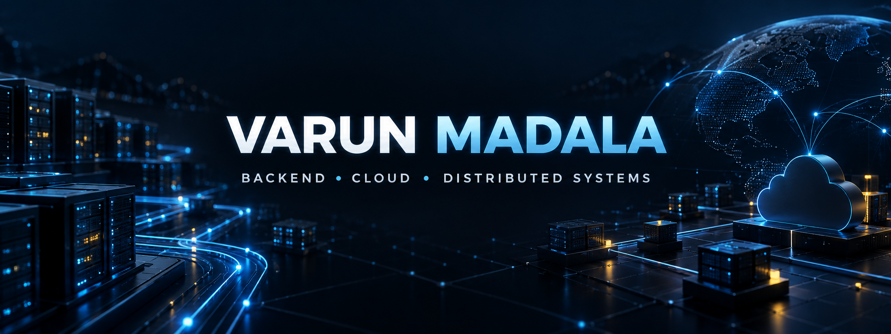
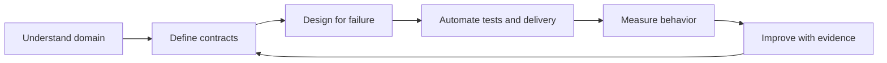

<div align="center">

# Varun Madala

### Software Development Engineer building resilient APIs, event-driven platforms, and cloud-native systems

[](https://www.linkedin.com/in/varun-madala)
[](https://github.com/MadalaVarun/varun-engineering-portfolio)
[](https://www.google.com/maps/place/Atlanta,+GA)

</div>

## Engineering profile

I am a backend-focused Software Development Engineer with 5+ years of experience across healthcare, education, and retail systems. I work at the intersection of **API design, distributed workflows, cloud infrastructure, data platforms, security, and reliability engineering**.

```text
DESIGN      REST · GraphQL · gRPC · Microservices · Event-Driven Systems
BUILD       C# · .NET Core · ASP.NET MVC · Python · FastAPI · SQL/NoSQL
OPERATE     Docker · Kubernetes · Terraform · AWS · Azure · CI/CD
OBSERVE     OpenTelemetry · Prometheus · Grafana · Splunk
PROTECT     OAuth 2.0 · RBAC · Tenant Isolation · Audit Trails · PHI Safety
```

## Featured engineering work

| Project | Engineering challenge | Demonstrated capability |
|---|---|---|
| [Healthcare Claims API](https://github.com/MadalaVarun/healthcare-claims-api) | Safe retries and transactional claim intake | REST, validation, SQLite, idempotency, Docker, CI |
| [Member Eligibility Pipeline](https://github.com/MadalaVarun/member-eligibility-pipeline) | Duplicate-safe asynchronous processing | Event processing, atomic state, replay safety |
| [GraphQL Member Gateway](https://github.com/MadalaVarun/graphql-member-gateway) | Secure multi-tenant data composition | Tenant isolation, field authorization, query limits |
| [PHI Access & Audit Service](https://github.com/MadalaVarun/phi-access-audit-service) | Traceable access to sensitive workflows | RBAC and tamper-evident audit chains |
| [Partner API Gateway](https://github.com/MadalaVarun/partner-api-gateway) | Protecting services from partner failures | Rate limiting and circuit-breaker behavior |
| [Chaos Engineering Lab](https://github.com/MadalaVarun/microservice-chaos-lab) | Proving recovery under controlled failure | Steady-state checks, abort rules, recovery validation |

> **Portfolio standard:** all 20 repositories contain runnable portfolio MVP code, automated tests, Docker support, passing GitHub Actions CI, documentation, an MIT license, and an open contribution-guidelines pull request. Healthcare examples use synthetic data only.

## Core technical skills

| Area | Technologies |
|---|---|
| **Languages & Backend** | C#, Python, JavaScript, TypeScript, .NET Core, ASP.NET MVC 5.0, ASP.NET Web Forms, FastAPI, Flask, OOP |
| **Architecture & APIs** | Microservices, Event-Driven Systems, REST, GraphQL, gRPC, Idempotency, Circuit Breakers |
| **Data & Messaging** | SQL Server, PostgreSQL, Oracle, Cosmos DB, MongoDB, Redis, Kafka, RabbitMQ |
| **Cloud & Delivery** | AWS, Azure, Docker, Kubernetes, Terraform, CloudFormation, GitHub Actions, Jenkins |
| **Reliability** | OpenTelemetry, Prometheus, Grafana, Splunk, SLOs, Distributed Tracing, Chaos Testing |
| **Healthcare** | Claims, Eligibility, Policy, Secure PHI Workflows, RBAC, Auditability |

## Complete project portfolio

<details>
<summary><strong>Healthcare, security, and AI</strong></summary>

- [Healthcare Claims API](https://github.com/MadalaVarun/healthcare-claims-api)
- [Member Eligibility Event Pipeline](https://github.com/MadalaVarun/member-eligibility-pipeline)
- [PHI Access Control & Audit Service](https://github.com/MadalaVarun/phi-access-audit-service)
- [Healthcare Operations AI Assistant](https://github.com/MadalaVarun/healthcare-ai-assistant)
- [Policy Administration Service](https://github.com/MadalaVarun/grpc-policy-service)
- [Claims Data Migration Toolkit](https://github.com/MadalaVarun/claims-data-migration-toolkit)

</details>

<details>
<summary><strong>Distributed systems, APIs, and data</strong></summary>

- [GraphQL Member Gateway](https://github.com/MadalaVarun/graphql-member-gateway)
- [Partner API Gateway](https://github.com/MadalaVarun/partner-api-gateway)
- [Hybrid SQL/NoSQL Data Platform](https://github.com/MadalaVarun/hybrid-data-platform)
- [RabbitMQ Notification Platform](https://github.com/MadalaVarun/rabbitmq-notification-platform)
- [Distributed Cache Benchmark](https://github.com/MadalaVarun/distributed-cache-benchmark)
- [Exam Workflow Orchestrator](https://github.com/MadalaVarun/exam-workflow-orchestrator)

</details>

<details>
<summary><strong>Cloud, DevOps, reliability, and business platforms</strong></summary>

- [Kubernetes Claims Worker](https://github.com/MadalaVarun/kubernetes-claims-worker)
- [Azure Terraform Platform](https://github.com/MadalaVarun/azure-terraform-platform)
- [GitHub Actions Delivery Platform](https://github.com/MadalaVarun/github-actions-delivery-platform)
- [Claims Observability Lab](https://github.com/MadalaVarun/claims-observability-lab)
- [Microservice Chaos Engineering Lab](https://github.com/MadalaVarun/microservice-chaos-lab)
- [Cloud Cost & Capacity Analyzer](https://github.com/MadalaVarun/cloud-cost-capacity-analyzer)
- [POS Inventory Service](https://github.com/MadalaVarun/pos-inventory-service)
- [Academic Assessment Engine](https://github.com/MadalaVarun/academic-assessment-engine)

</details>

## Engineering loop



- Make retry behavior and failure boundaries explicit.
- Treat observability and security as design inputs.
- Prefer measurable tradeoffs over technology-by-fashion.
- Keep sensitive and proprietary data out of public demonstrations.

## Current focus

- Deepening production-grade .NET and Python reference implementations
- Reliable event-driven orchestration and platform automation
- Secure, auditable AI-assisted enterprise workflows
- Performance engineering across APIs, databases, queues, and caches

---

<div align="center">

### Build systems that stay understandable when scale and failure arrive.

**Varun Madala** · Software Development Engineer · Atlanta, Georgia

</div>
